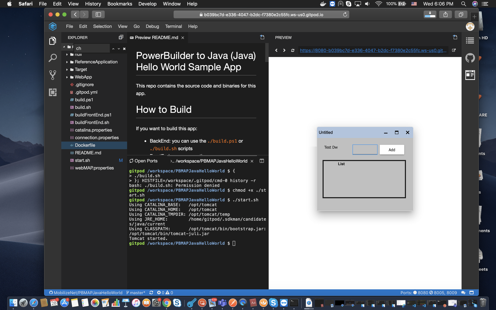

# PBJava

PBJava is a tool that understands your PowerBuilder application and converts it to a Java web application that uses frameworks such as Maven, Spring, Angular, CSS, and Typescript.

This tool has the ability to process the source code to generate Java, Angular, HTML, and CSS files. This Java web application can then be deployed in a Tomcat server with common standards of security, navigation, database interactions, and support when extending.

Instead of manually rewriting an entire application, we help you by automating this process using PBJava. This reduces costs, risks and time, while keeping the existing business logic intact.

For more details you can go to our [website](https://www.mobilize.net/powerbuilder) or check our documentation at https://docs.mobilize.net/

# PowerBuilder to Java (Java) Hello World Sample App

This repo contains the source code and binaries for the PBJavaHelloWorld app.

This app is just shows a Powerbuilder Window with a datawindow that implements a simple todo list.

The sample was migrated with our [tools](https://mobilize.net/powerbuilder) to a Spring Java application with an Angular FrontEnd.

You can see an screenshot of this repo on Safari on MAC OS

# How to Build

If you want to build this app:

- BackEnd: you can use the `./build.ps1` or `./build.sh` scripts
- FrontEnd: you can use the `./buildFrontEnd.ps1` or `./buildFrontEnd.sh`

# Code Structure

When you migrate your app from Powerbuilder to Java you will have 3 main folders:

- WebApp
- Target
- ReferenceApplication

For an overview of the migrated code see [Migrated Code Overview](https://docs.mobilize.net/PBJava/articles/migration/postmigrationprocess.html#migrated-code-overview)

## WebApp
Angular FrontEnd is inside this folder.

This folder is structured as:
- WebApp\sampleSite\sampleSite-angular
    - src
        - app
            - components\sample
                - d_sample_list
                - w_sample
    - wwwroot *(this is generated after Angular Compilation)*

## Target
The migrated powerbuilder code to java is inside this folder.

## ReferenceAppl
The project to generate the WAR is here.

# Running the app directly from your browser

If you do not want to install anything but still wnat to take a look at migrated application your can open the application using the links below:

